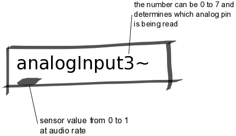

Analog Input Abstractions
#########################
These abstractions manage the input from an analog sensor. The number at the end of `analogInput~` indicates the channel number and can be 0 up to 7.

Repository
**********
The abstractions can be found on `github. <https://github.com/theleadingzero/pure-data-bela-tutorials/blob/master/abstractions/analogInput0~.pd>`_

Inlets
******
None

Outlets
*******
Outputs a number between 0 and 1 at audio rate.

