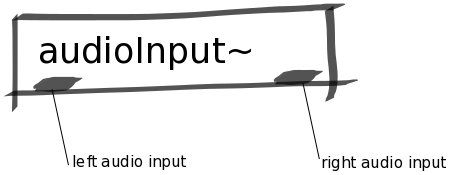

Audio Input Abstraction
#######################
This abstraction is a simple wrapper for the two audio inputs on Bela.

Repository
**********
The abstractions can be found on `github. <https://github.com/theleadingzero/pure-data-bela-tutorials/blob/master/abstractions/audioInput~.pd>`_

Inlets
******
None

Outlets
*******
Left outlet is left audio input channel and the right outlet is right audio input channel.
