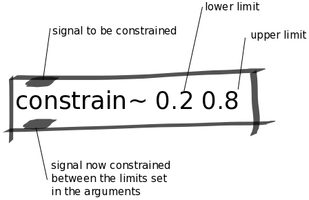

Constrain Abstraction
#####################
This abstraction constrains a signal between two values. This is a useful abstraction for situations in which you only want to concentrate on a subset of the full range of a sensor's signal.

Repository
**********
The abstractions can be found on `github. <https://github.com/theleadingzero/pure-data-bela-tutorials/blob/master/abstractions/constrain~.pd>`_

Arguments
*********
The first argument is the lower bound and the second argument is the higher bound.

Inlets
******
Left inlet is the signal to be constrained.

Outlets
*******
Left outlet is the signal after it has been constrained between the two values specified as its arguments.
