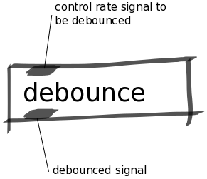

Debounce Abstraction
####################
This abstraction is a debouncer which is used with control rate signals. Any variations in value that it receives is ignored for a short period of time (3ms). This is useful for when you have a button that can be prone to mechanical "bouncing" - when the metal contacts of a button open and close multiple times before settling on a value. This abstraction will ignore any variation in a signal which happen within the debounce time threshold (3ms) and instead output a stable value. A debounced button means that double triggering can be avoided.

Repository
**********
The abstractions can be found on `github. <https://github.com/theleadingzero/pure-data-bela-tutorials/blob/master/abstractions/debounce.pd>`_

Inlets
******
Left inlet expects a control rate signal.

Outlets
*******
Left outlet ouputs the debounced control rate signal.

