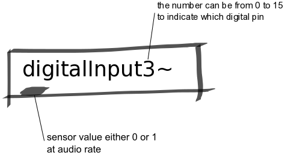

Digital Input Abstraction
#########################
These abstractions manages the input from a digital sensor. The number at the end of `digitalInput#~` indicates the channel number and can be 0 up to 15. This 

Repository
**********
The abstractions can be found on `github. <https://github.com/theleadingzero/pure-data-bela-tutorials/blob/master/abstractions/digitalInput0.pd>`_

Inlets
******
None

Outlets
*******
Outputs the readings from the digital input pin that is specified in the number in the name.
