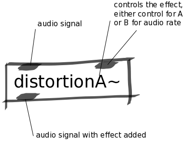

Distortion Abstractions
#######################
These abstractions are audio-rate distortion effects. Any audio signals that are passed through the abstraction will come out distorted.

The abstraction has two versions, `A` and `B`. `A` is controlled by a control rate signal (like a slider object) and `B` is controlled by an audio rate signal (like an analog input).

Repository
**********
The abstractions can be found on `github. <https://github.com/theleadingzero/pure-data-bela-tutorials/blob/master/abstractions/distortionA~.pd>`_

Inlets
******
Left inlet is for the audio signal that you want to be distorted. 

The second inlet expects a control or audio rate signal (depending on the version of the abstraction) and controls the wet/dry balance of the effect meaning the total amount of distortion added to the signal.

Outlets
*******
Left outlet is the audio signal after it has been distorted.
