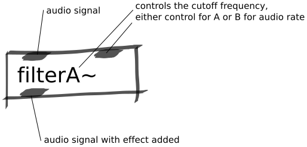

Filter Abstractions
###################
These abstractions are audio-rate high pass filter effects. This effect will cut off the low frequencies in an audio signal and allow the higher frequencies to pass (hence high pass).

The abstraction has two versions, `A` and `B`. `A` is controlled by a control rate signal (like a slider object) and `B` is controlled by an audio rate signal (like an analog input).

Repository
**********
The abstractions can be found on `github. <https://github.com/theleadingzero/pure-data-bela-tutorials/blob/master/abstractions/filterA~.pd>`_

Inlets
******
Left inlet is for the audio signal that you want to be put through the filter effect. 

The second inlet expects a control or audio rate signal (depending on the version of the abstraction) and controls cut off frequency of the filter.

Outlets
*******
Left outlet is the audio signal with the filter effect applied.
