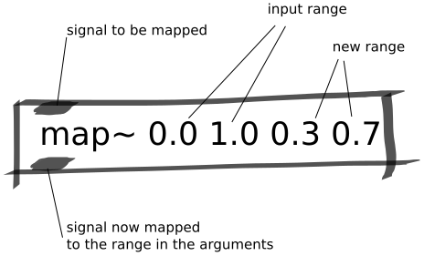

Map Abstraction
###############
This abstraction maps a signal from one range to another. This is a useful abstraction for situations in which you only want to map the range of a sensor's signal to another range of values.

Repository
**********
The abstractions can be found on `github. <https://github.com/theleadingzero/pure-data-bela-tutorials/blob/master/abstractions/map~.pd>`_

Arguments
*********
The first and second arguments are the input range. The third and fourth arguments are the output ranges.

Inlets
******
Left inlet is the signal to be mapped.

Outlets
*******
Left outlet is the signal after it has been mapped according to the values specified as its arguments.
