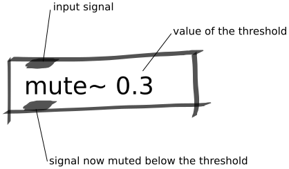

Mute Below Threshold Abstraction
################################
This abstraction mutes a signal when below a certain threshold. This is a useful abstraction for situations in which you only want to use a sensor's signal once it has passed over a threshold.

Repository
**********
The abstractions can be found on `github. <https://github.com/theleadingzero/pure-data-bela-tutorials/blob/master/abstractions/mute-below-thresh~.pd>`_

Arguments
*********
The first argument sets the threshold.

Inlets
******
Left inlet is the signal to thresholded.

Outlets
*******
Left outlet is the output signal.
