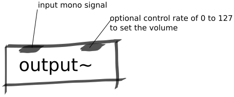

Audio Output Abstraction
########################
This abstraction is the output for stereo audio on Bela.

Repository
**********
The abstractions can be found on `github. <https://github.com/theleadingzero/pure-data-bela-tutorials/blob/master/abstractions/output~.pd>`_

Inlets
******
The left inlet is the audio signal you want to send to the audio output of Bela. The right inlet is an optional volume control which expects a control signal between 0 and 127.

Outlets
*******
No outlets.