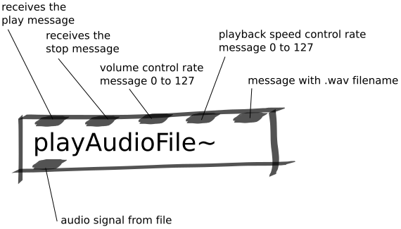

Play Audio File Abstraction
###########################
This abstraction is used for playing back audio files.

Repository
**********
The abstractions can be found on `github. <https://github.com/theleadingzero/pure-data-bela-tutorials/blob/master/abstractions/playAudioFile~.pd>`_

Inlets
******
The first inlet is where the play message or bang should be sent to start a file playing back. 

The second inlet is where a stop message or bang should be sent to stop a file playing back. 

The third inlet expects a control rate signal from 0 to 127 and controls the volume of the playback. 

The fourth inlet expects a control rate signal from 0 to 127 and controls the speed of the sample playback and hence its pitch. 

The fifth inlet expects a message with the filename of the sample to be played back. The file needs to be .wav (mp3 not supported) and located in the project folder or the ``pd-externals`` project folder.

Outlets
*******
Left outlet is the audio signal that is played back.
