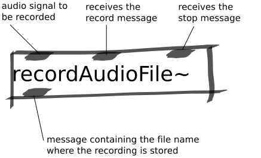

Record Audio File Abstraction
#############################
This abstraction is used for recording audio.

Repository
**********
The abstractions can be found on `github. <https://github.com/theleadingzero/pure-data-bela-tutorials/blob/master/abstractions/recordAudioFile~.pd>`_

Inlets
******
The first inlet is where the audio signal that should be recorded is to be connected. 

The second inlet is where a trigger message or bang should be sent to start a recording. 

The third inlet is where a trigger message or bang should be sent to stop a recording.

Outlets
*******
The outlet of this abstraction is the filename of the recording which can be used to tell playAudioFile~ which file to begin playing back.
