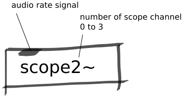

Scope Abstraction
#################
These abstractions send signals to the scope in the browser-based IDE of Bela which can be accessed at ``http://bela.local/scope`` when Bela is connected to your computer. The number at the end of `scope#~` indicates the channel number and can be 0 up to 3.

Repository
**********
The abstractions can be found on `github. <https://github.com/theleadingzero/pure-data-bela-tutorials/blob/master/abstractions/scope0~.pd>`_

Inlets
******
The audio-rate signal to be sent to the scope.

Outlets
*******
None.

