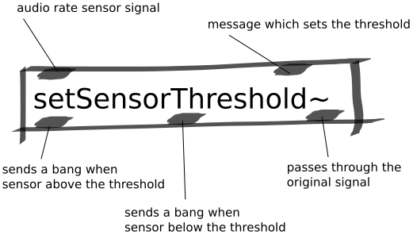

Set Sensor Threshold Abstraction
################################
This abstraction can be used to detect a touch on a sensor once it passes a certain threshold. It also detects when a touch is released.

This is a useful abstraction for situations in which you only want to use a sensor's signal once it has passed over a threshold.

Repository
**********
The abstraction can be found on `github. <https://github.com/theleadingzero/pure-data-bela-tutorials/blob/master/abstractions/mute-below-thresh~.pd>`_

Inlets
******
The first inlet is the sensor signal as input. 

The second inlet receives a message which sets the threshold over which a touch is sensed.

Outlets
*******
The first outlet produces a trigger when a touch is detected. 

The second outlet produces a trigger when a touch is released. 

The third outlet passes the sensor signal through unmodified.
