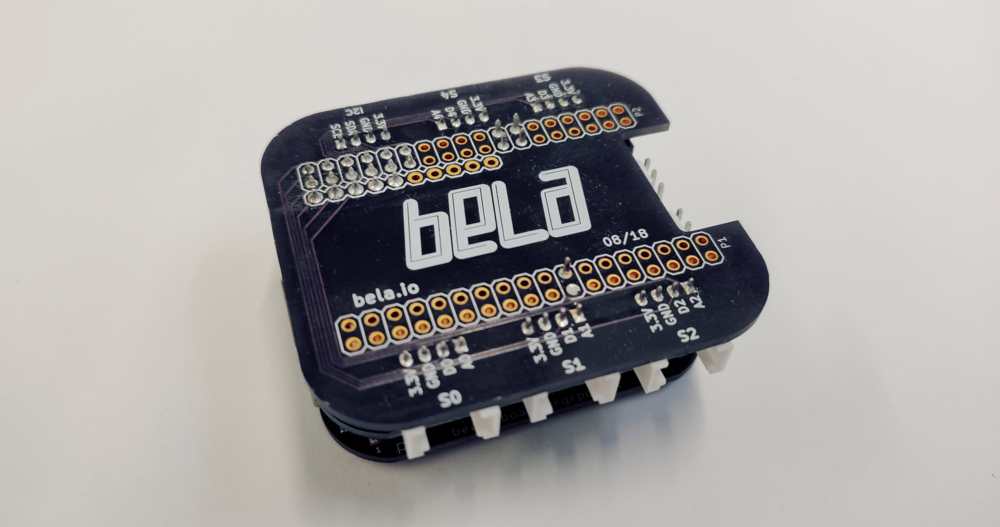

Paper Capelet
#############

The Paper Capelet is a circuit board that attach on top of your Bela Mini. It provides electrical connections to the first 4 analog input pins, first 4 digital pins, and I2C via the Grove connectors.

.. image:: https://oshpark.com/assets/badge-5b7ec47045b78aef6eb9d83b3bac6b1920de805e9a0c227658eac6e19a045b9c.png
  :alt: "Order from OSH Park"
  :target: https://oshpark.com/shared_projects/EoGQSTLz

Building the Paper Capelet
**************************

You will need
=============

* Paper Capelet PCB
* 18 header pins
* 5 longer header pins

Steps
=====
1. Order directly or download the gbr files from `OSH Park <https://oshpark.com/shared_projects/EoGQSTLz>`_ and fabricate the PCB.

2. Solder the header pins to the highlighted holes on the board. The rest of the holes are kept accessible for more advanced users who may want to still use the other pins. Only the inside pin of the pair highlighted near S1 needs an electrical connection, but you may find it easier to connect and disconnect the capelet with both soldered in place.

  .. image:: ./imgs/paper-capelet-pins-1.jpg
    :width: 400
    :alt: Photo of underside of capelet.

3. Solder the 5 longer header pins to the first 5 analog pins highlighted on the capelet.

  .. image:: ./imgs/paper-capelet-pins-2.jpg
    :width: 400
    :alt: Photo of underside of capelet.