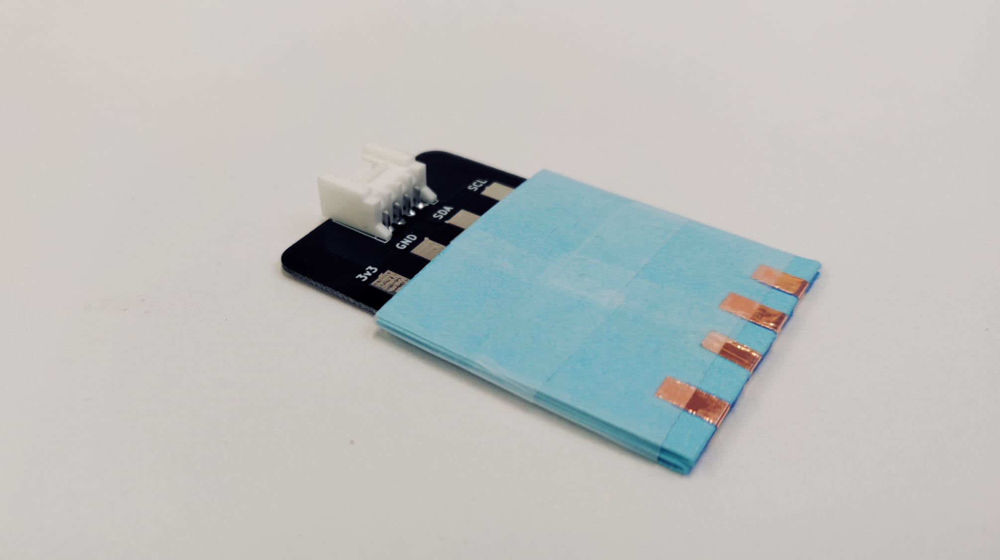

I2C Pocket Connector
####################

The I2C Pocket Connector connects I2C sensor circuits to the Paper Capelet. It breaks out the 3.3V, GND, SCL, and SDA GPIO pin connections on the Grove connector. These are electrically connected to a folded paper pocket that then provides a mechanical and electrical connection to the sensing circuit.

You need to order or fabricate the printed circuit board (PCB), and then can add the rest of the components.

.. image:: https://oshpark.com/assets/badge-5b7ec47045b78aef6eb9d83b3bac6b1920de805e9a0c227658eac6e19a045b9c.png
  :alt: "Order from OSH Park"
  :target: https://oshpark.com/shared_projects/zmLvfe6q

Building the I2C Pocket Connector
*********************************

You will need
=============

* I2C Pocket Connector PCB
* Grove horizontal DIP connector 
* Paper template
* Strip of 0.25"/5mm copper tape  
* Scotch/Sello tape 
* Soldering equipment

Steps
=====
1. Order directly or download the gbr files from `OSH Park <https://oshpark.com/shared_projects/zmLvfe6q>`_ and fabricate the PCB.

2. Solder the Grove connector to the PCB, following the outline of the silkscreen.
  
  .. image:: ./imgs/pocket-i2c-soldered.jpg
    :width: 400
    :alt: Photo of PCB with Grove connector soldered.

3. Download the template from the `embelashed repository <https://github.com/theleadingzero/embelashed/tree/master/paper/pocket-connector-cutting-files/i2c>`_. The `.studio3` file is for a `Silhouette machine <https://www.silhouetteamerica.com/>`_ and the other files can be used with a printer or laser cutter. The red lines are where the template should be cut and the blue lines are where an outline should be drawn. 

4. Cut out the paper template using your preferred method.    
  
  .. image:: ./imgs/template-4.jpg
    :width: 400
    :alt: Photo of paper template cutout and with guide outlines drawn.

5. Cut the copper tape in half lengthwise with a pair of scissors.

  .. image:: ./imgs/cut_24_0-18.gif
    :alt: Animation of cutting copper tape.

6. Stick the three pieces of copper tape onto the paper template, following the outlines.
  
  .. image:: ./imgs/copper-paper-4.jpg
    :width: 400
    :alt: Photo of paper template with copper tape.

7. Fold the template along the guidelines. Start by folding the template in half with the copper tape on the inside. Then fold along the other two lines to create an accordion shape.
   
  .. image:: ./imgs/accordion-4.jpg  
    :width: 400 
    :alt: Photo of folded template in accordion shape.

8. Identify the side of the folded template with an outline that matches the edge of the PCB. It is also the side with more copper tape. Place that side on the top of the PCB, lining up the outline with the edge of the PCB.

9. Using non-conductive tape like scotch/sello tape, tape the paper template to the PCB, taking care to leave open the pocket edge. 
  
  .. image:: ./imgs/pocket-i2c-complete.jpg
    :height: 300
    :alt: Photo of top of completed Pocket Connector.

  .. image:: ./imgs/pocket-underside-i2c.jpg
    :height: 300
    :alt: Photo of bottom of completed Pocket Connector.

