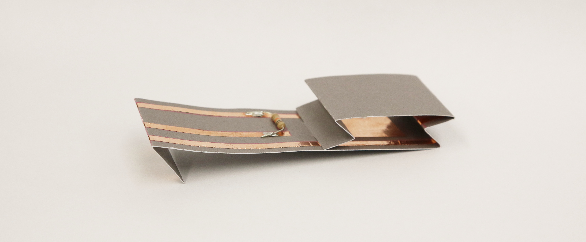

Button Switch
#############

What does the sensor do?
************************
It is a switch! It is either pressed or not pressed.

Building the Paper Circuit
**************************

.. image:: ./imgs/switch.png
  :width: 600
  :alt: Illustration of switch paper circuit.

You will need
=============
* Paper template
* 3 strips of 0.25"/5mm copper tape and some copper pads
* 10k ohm resistor (10kΩ)
* Soldering equipment

Steps
=====
#. Download the template from the `embelashed repository <https://github.com/theleadingzero/embelashed/tree/master/paper/paper-sensor-cutting-files/button-switch>`_. The `.studio3` file is for a `Silhouette machine <https://www.silhouetteamerica.com/>`_ and the other files can be used with a printer or laser cutter. The red lines are where the template should be cut and the blue lines are where an outline should be drawn. 

#. Using the tools of your choice, cut the template out of paper.

#. Cut the copper tape in half lengthwise with a pair of scissors.

  .. image:: ./imgs/cut_24_0-18.gif
    :alt: Animation of cutting copper tape.

4. Stick the copper tape to the paper template.

  .. image:: ./imgs/ldr-tape_18_0-18.gif
    :alt: Animation of sticking down the copper tape.

5. Solder components and fold to fit to the breakout board connector. Need help with soldering? Feel free to ask someone for help if you are attending a workshop, or check out `Adafruit's soldering guide <https://learn.adafruit.com/adafruit-guide-excellent-soldering/making-a-good-solder-joint>`_. Always wear protective glasses.

  .. image:: ./imgs/ldr-solder_18_0-18.gif
    :alt: Animation of soldering.

.. note::
  We are using a pull-down resistor. This means our circuit is connected to ground when the button is not pressed.