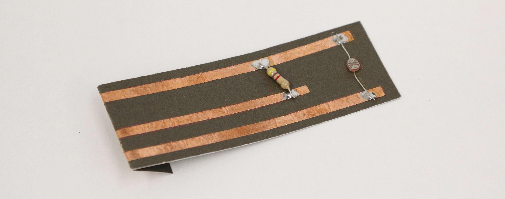

Light Sensor
############

What does the sensor do?
************************
The light dependent resistor (LDR) can sense the change of the light. The conductivity changes when the amount of light exposed to the sensor surface changes. It can be very sensitive even detecting movement around the sensor with passing shadows.

Building the Paper Circuit
**************************

.. image:: ./imgs/ldr_3.png 
  :width: 600
  :alt: Illustration of LDR paper circuit.

You will need
=============
* LDR
* Paper template
* 3 strips of 0.25"/5mm copper tape
* 4.6k ohm resistor (4k6Ω)
* Soldering equipment

Steps
=====
#. Download the template from the `embelashed repository <https://github.com/theleadingzero/embelashed/tree/master/paper/paper-sensor-cutting-files/light-sensor>`_. The `.studio3` file is for a `Silhouette machine <https://www.silhouetteamerica.com/>`_ and the other files can be used with a printer or laser cutter. The red lines are where the template should be cut and the blue lines are where an outline should be drawn. 

#. Using the tools of your choice, cut the template out of paper.

#. Cut the copper tape in half lengthwise with a pair of scissors.

  .. image:: ./imgs/cut_24_0-18.gif
    :alt: Animation of cutting copper tape.

4. Stick the copper tape to the paper template

  .. image:: ./imgs/ldr-tape_18_0-18.gif
    :alt: Animation of sticking down the copper tape.

5. Solder components and fold to fit to the breakout board connector. Need help with soldering? Feel free to ask someone for help if you are attending a workshop, or check out `Adafruit's soldering guide <https://learn.adafruit.com/adafruit-guide-excellent-soldering/making-a-good-solder-joint>`_. Always wear protective glasses.

  .. image:: ./imgs/ldr-solder_18_0-18.gif
    :alt: Animation of soldering.

.. note::
  We are creating a voltage divider circuit for our sensor to translate the change of resistance into a change of voltage. 

What Kind of Interactions or Movement Can It Sense?
***************************************************

1. Environment
The brightness changes of the environment around the sensor.

.. image:: ./imgs/LDR_ENVIRONMENT.gif
  :width: 300
  :alt: Animation of sensing the presence of a light.

.. note::
  When embedding inside paper, use white and thin paper that allows light to go through. This would work well with the LDR, as Bela is able to get a larger range of values when the light changes.

2. Movement
It can sense all kinds of movements such as hip twisting, handshaking, arm waving and more!

.. image: ./imgs/LDR_shaking.gif
  :width: 300
  :alt: Animation of shaking an object.

3. Distance
You can sense both distance between the body and the sensor or between the objects and the sensor.

.. image:: ./imgs/yellow.gif 
  :width: 300
  :alt: Animation of sensing the shadow of a hand.
