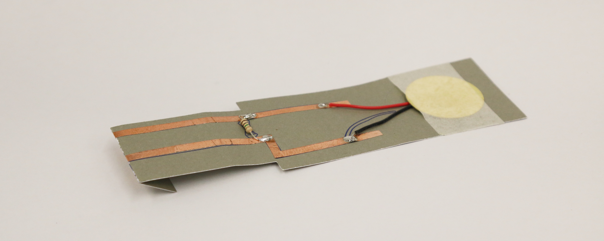

Piezo Vibration Sensor
######################

What does the sensor do?
************************
The piezo can sense vibrations, such as knocking or sound waves by capturing the vibration and converting it into an electrical voltage. In some cases, this sensor can also be used as a small audio transducer or microphone.

Building the Paper Circuit
**************************

.. image:: ./imgs/piezo_small.png
  :width: 600
  :alt: Illustration of piezo circuit.

You will need
=============
* Paper template
* Piezo sensor   
* 2 strips of 0.25"/5mm copper tape   
* Wire cutters
* Two 1 megaohm resistors (1MΩ)  
* Soldering equipment

Steps
=====
#. Download the template from the `embelashed repository <https://github.com/theleadingzero/embelashed/tree/master/paper/paper-sensor-cutting-files/piezo-vibration-sensor>`_. The `.studio3` file is for a `Silhouette machine <https://www.silhouetteamerica.com/>`_ and the other files can be used with a printer or laser cutter. The red lines are where the template should be cut and the blue lines are where an outline should be drawn. 

#. Using the tools of your choice, cut the template out of paper.

#. Cut the copper tape in half lengthwise with a pair of scissors.

  .. image:: ./imgs/cut_24_0-18.gif
    :alt: Animation of cutting copper tape.

4. Stick the copper tape to the paper template.

  .. image:: ./imgs/piezo-tape_18_0-18.gif
    :alt: Animation of sticking down the copper tape.

  .. note::
    Make folds in the copper tape to keep a continuous connection.

    .. image:: ./imgs/folding.png
      :width: 400
      :alt: How to fold a corner of copper tape.

5. Cut the piezo insulation to expose the wire using a pair of wire cutters.

  .. image:: ./imgs/piezo-wire_18_0-18.gif
    :alt: Animation of trimming the piezo wires.

6. Solder components and fold to fit to the breakout board connector. Need help with soldering? Feel free to ask someone for help if you are attending a workshop, or check out `Adafruit's soldering guide <https://learn.adafruit.com/adafruit-guide-excellent-soldering/making-a-good-solder-joint>`_. Always wear protective glasses.

  .. image:: ./imgs/piezo-solder_18_0-18.gif
    :alt: Animation of soldering.

  .. note::  
    There are two wires connected with piezo, the black wire should be connected to the "ground", the red one should be connected to the "input".

.. note::
  We are creating a voltage biasing circuit for our sensor so that the piezo only outputs a positive voltage. `Click here to read more on the Bela blog. <https://blog.bela.io/2017/01/11/percussion/>`_ 

What Kind of Interactions or Movement Can It Sense?
***************************************************
1. Environment
Piezos can sense when they are hit against objects.  

.. image:: ./imgs/hit.gif
  :width: 300
  :alt: Animation of two objects striking each other.

2. Movement
Knocking, shaking, flipping, tapping…and more!  

.. image:: ./imgs/knock.gif 
  :width: 300
  :alt: Animation of an object being tapped.

.. note::
  If you feel the piezo is too sensitive to realise your intended interaction, replace the 1M ohm resistors with a lower resistor value such as a pair of 100K ohm resistors, the less resistance used in the circuit, the less sensitive your piezo will be.

