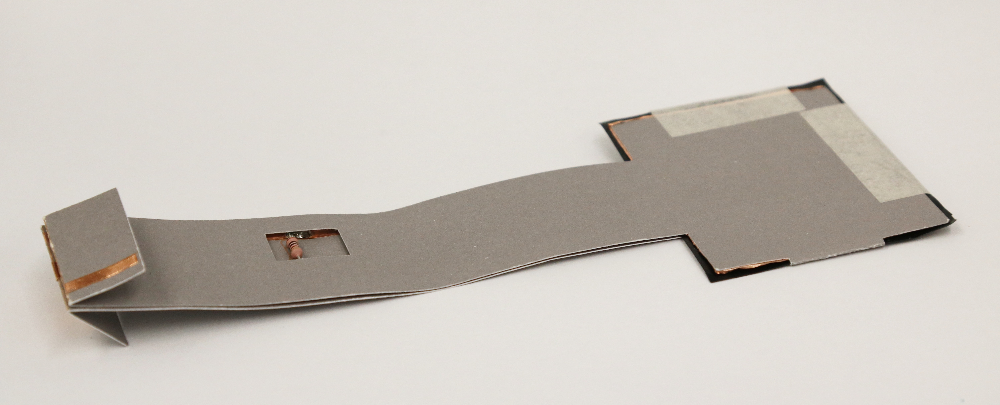

Pressure Sensor
###############

What does the sensor do?
************************
Velostat is a black plastic sheet which is pressure-sensitive and conductive sheet. It can detect force pressed on its surface. The conductivity changes when the pressure on it changes. It is flexible and can be used in paper circuitry.

Building the Paper Circuit
**************************

.. image:: ./imgs/velo1_small2.png
  :width: 600
  :alt: Illustration of a pressure sensor circuit.

You will need
=============

* Paper template
* Square of Velostat that fits to the paper templates
* 3 strips of 0.25"/5mm copper tape
* 2 1x1"/ 25x25mm squares of copper tape
* Masking tape
* 1k ohm resistor (1kΩ) 
* Soldering equipment

   

Steps
=====
#. Download the template from the `embelashed repository <https://github.com/theleadingzero/embelashed/tree/master/paper/paper-sensor-cutting-files/pressure-switch>`_. The `.studio3` file is for a `Silhouette machine <https://www.silhouetteamerica.com/>`_ and the other files can be used with a printer or laser cutter. The red lines are where the template should be cut and the blue lines are where an outline should be drawn. 

#. Using the tools of your choice, cut the template out of paper.

#. Cut the copper tape in half lengthwise with a pair of scissors.

  .. image:: ./imgs/cut_24_0-18.gif
    :alt: Animation of cutting copper tape.

3. Stick the copper tape to the paper template

  .. image:: ./imgs/velo-tape_18_0-18.gif
    :alt: Animation of sticking down the copper tape.

4. Stick down the copper pads so that they overlap the copper tape

  .. image:: ./imgs/velo-pad_18_0-18.gif
    :alt: Animation of sticking down the copper pads.

5. Solder the resistor and the copper pad to the tape. Need help with soldering? Feel free to ask someone for help if you are attending a workshop, or check out `Adafruit's soldering guide <https://learn.adafruit.com/adafruit-guide-excellent-soldering/making-a-good-solder-joint>`_. Always wear protective glasses.

6. Cut the velostat to be 1-2mm larger than the copper and sandwich it in between the two copper pads. You can use a small piece of tape to secure it.

  .. image:: ./imgs/velo-velo_18_0-18.gif
    :alt: Animation of cutting out the Velostat.

  .. note:: 
    Pasting the masking tape around the sensor is not only fixing Velostat, but also secure the circuitry from short circuits. Attaching the two parts of circuit using the non-conductive tape will be more convenient for you to embed the sensor to your prototype.

.. note::
  We are creating a voltage divider circuit for our sensor to translate a change of resistance into a change of voltage. 

What Kind of Interactions or Movement Can It Sense?
***************************************************

1. Movement  
You can sense pressing or pushing.  

.. image:: ./imgs/pressure.gif
  :width: 300
  :alt: Animation of pressing on the sensor.

2. Cooperation
It is a pressure sensor so can sense contact between people.  

.. image:: ./imgs/TOUCH.gif 
  :width: 300
  :alt: Animation of two hands touching.

3. Environment  
You could sense leaning or bumping against objects, sitting on a chair or all kinds of things!
