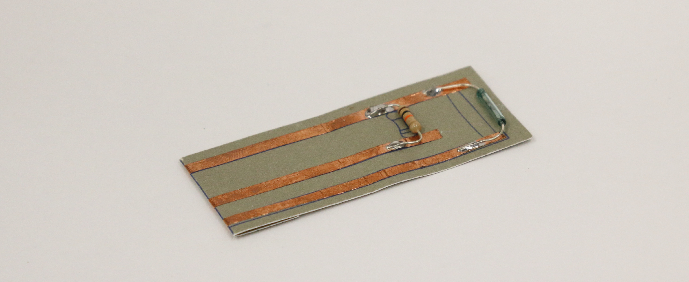

Magnetic Switch
###############

What does the sensor do?
************************
Unlike the Velostat pressure and light dependent resistor that can generate continuous signal, the reed switch acts more like a button, instead of switching on/off by physically pressing, the sensor can close the circuit when detecting a magnetic field.

Building the Paper Circuit
**************************

.. image:: ./imgs/Reed_Switch.png 
  :width: 500
  :alt: Illustration of reed switch paper circuit.

You will need
=============

* Paper
* Reed switch  
* 3 strips of 0.25"/5mm copper tape  
* 10k ohm resistor (10kΩ)  
* Soldering equipment

.. warning::
  The reed switch is very fragile, be careful with it, especially when bending the legs!

Steps
=====
#. Download the template from the `embelashed repository <https://github.com/theleadingzero/embelashed/tree/master/paper/paper-sensor-cutting-files/magnetic-switch>`_. The `.studio3` file is for a `Silhouette machine <https://www.silhouetteamerica.com/>`_ and the other files can be used with a printer or laser cutter. The red lines are where the template should be cut and the blue lines are where an outline should be drawn. 

#. Using the tools of your choice, cut the template out of paper.

#. Cut the copper tape in half lengthwise with a pair of scissors.

  .. image:: ./imgs/cut_24_0-18.gif
    :alt: Animation of cutting copper tape.

4. Stick the copper tape to the paper template

  .. image:: ./imgs/reed-tape_18_0-18.gif
    :alt: Animation of sticking down the copper tape.

5. Solder components and fold to fit to the breakout board connector. Need help with soldering? Feel free to ask someone for help if you are attending a workshop, or check out `Adafruit's soldering guide <https://learn.adafruit.com/adafruit-guide-excellent-soldering/making-a-good-solder-joint>`_. Always wear protective glasses.

  .. image:: ./imgs/reed-solder_18_0-18.gif
    :alt: Animation of soldering.

.. note::
  We are using a pull-down resistor in our circuit. This means that the switch is connected to ground when a magnet is not nearby.

What Kind of Interactions or Movement Can It Sense?
***************************************************
1. Environment  
The sensor can sense the magnetic field around it.          

.. image:: ./imgs/REED-SWITCH.gif
  :width: 300
  :alt: Animation of magnet near a reed switch.

2. Movement  
Bending arms; walking…and more      

3. Distance    
By placing magnet to body/object, it can sense the distance to the body/object.  

.. image:: ./imgs/reedswitch2.gif 
  :width: 300
  :alt: Animation of two objects approaching each other.

.. note:: 
  If the magnet has less magnetic force, the reed switch can only be switched on from a very short distance. A stronger magnet can help you close the circuit from a relatively far distance.  
