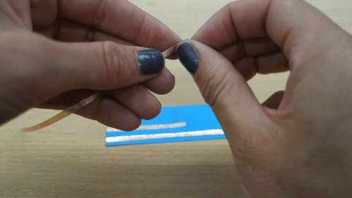

# **Light sensor**
## **What does the sensor do?**
The Light Dependent Resistor (LDR) can sense the change of the light. The conductivity changes when the amount of light on the surface changes. It is very sensitive and can detect your movement around the sensor.

## **How do you embed the sensor onto paper?**
You'll need:
- LDR
- paper template
- 3 strips of copper tape
- 4.6k ohm resistor (aka 4k6Ω)
- soldering equipment

**Suggested sequence for making**
- Cut the copper tape in half lengthwise with a pair of scissors

- Stick the copper tape to the paper template

- Solder components and fold to fit to the breakout board connector. Need help with soldering? Feel free to ask someone if you are at a workshop, or adafruit [have a good soldering guide](https://learn.adafruit.com/adafruit-guide-excellent-soldering/making-a-good-solder-joint). Always wear protective glasses.

>**Some technical info**
>We are using a "pull-down" resistor so that we can know the state of the sensor signal. Find out more about this [here](http://cnmat.berkeley.edu/recipe/how_and_why_add_pull_and_pull_down_resistors_microcontroller_i_o_).

## **What kind of interactions or movemnent can you sense?**
### 1. Environment
The brightness changes of the environment around the sensor.

>*Handy hint!*
>When embedding inside paper, use white and thin paper that allows light to go through. This would work well with the LDR, as Bela is able to get a larger range of values when the light changes.

### 2. Movement
It can sense all kinds of movements such as hip twisting, handshaking, arm waving and more!

### 3. Distance
You can sense both distance between the body and the sensor or between the objects and the sensor.

