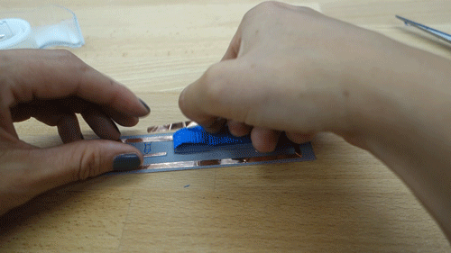
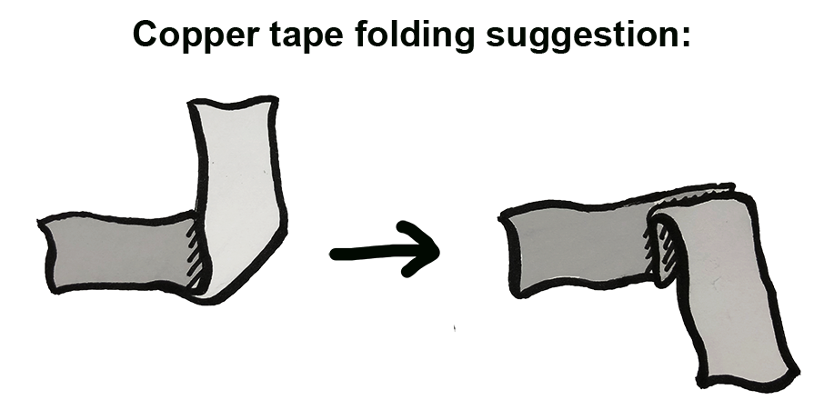

# **Movement sensor**
## **What does the sensor do?**
Unlike the Velostat and Light Dependent Resistor that can generate continuous signal, the movement sensor acts more like a button, instead of switching on/off by physically pressing, the sensor can close the circuit when moved around. A small weight made from cardboard is at a break in a circuit. A connection is made when the weight pivots from side to side.

## **How do you embed the sensor onto paper?**
You will need:
- Paper and card
- Scissors
- 3 strips of copper tape
- Sticky tape
- 10K ohm Resistor
- Soldering equipment

**Suggested sequence for making**
- Cut the copper tape in half lengthwise with a pair of scissors

- Stick the copper tape to the paper template

- Assemble the "flip" part

- Stick the "flip" part to the template

- Solder components. Need help with soldering? Feel free to ask someone if you are at a workshop, or adafruit [have a good soldering guide](https://learn.adafruit.com/adafruit-guide-excellent-soldering/making-a-good-solder-joint). Always wear protective glasses.

- Add some more sticky tape to secure the flip part

- Fold and secure with tape

>**Some technical info**
>We are using a "pull-down" resistor so that we can know the state of the sensor signal. Find out more about this [here](http://cnmat.berkeley.edu/recipe/how_and_why_add_pull_and_pull_down_resistors_microcontroller_i_o_).

> **Handy hint!**  
>Make folds in the copper tape to keep a continuous connection.

