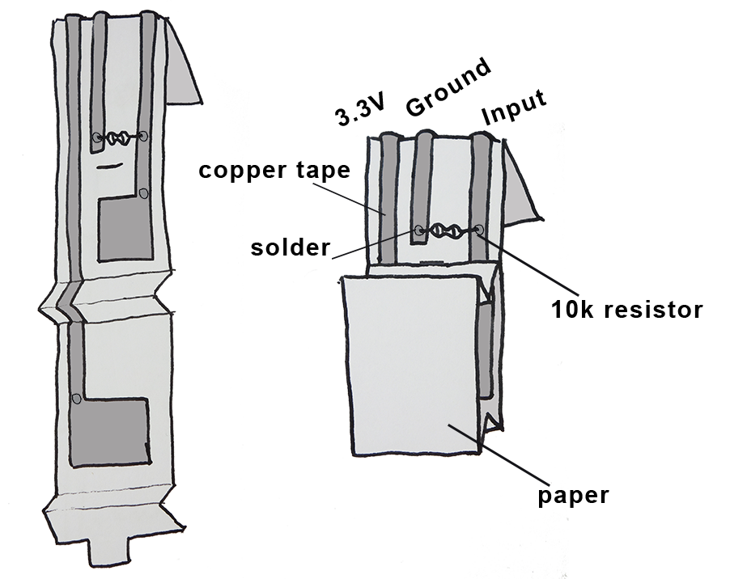

# **Switch**
## **What does the sensor do?**
It is a switch!

## **How do you embed the sensor onto paper?**
You'll need:
- paper template
- 3 strips of copper tape and some copper pads
- 10k ohm resistor
- soldering equipment

**Suggested sequence for making**
- Cut the copper tape in half lengthwise with a pair of scissors

- Stick the copper tape to the paper template

- Solder components and fold to fit to the breakout board connector. Need help with soldering? Feel free to ask someone if you are at a workshop, or adafruit [have a good soldering guide](https://learn.adafruit.com/adafruit-guide-excellent-soldering/making-a-good-solder-joint). Always wear protective glasses.

>**Some technical info**
>We are using a "pull-down" resistor so that we can know the state of the sensor signal. Find out more about this [here](http://cnmat.berkeley.edu/recipe/how_and_why_add_pull_and_pull_down_resistors_microcontroller_i_o_).
