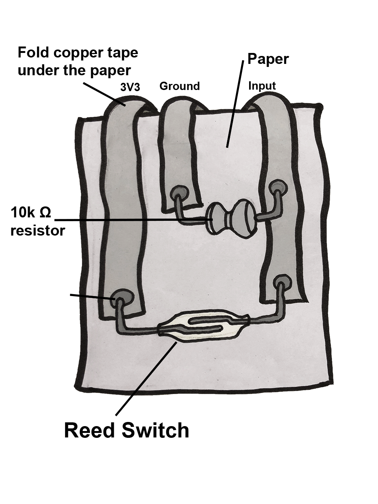

# **Magnetic sensor**
## **What does the sensor do?**
Unlike the Velostat and Light dependent resistor that can generate continuous signal, the Reed switch acts more like a button, instead of switching on/off by physically pressing, the sensor can close the circuit when detecting a magnetic field.
## **How do you embed the sensor onto paper?**  
You will need:

- Paper
- A reed switch  
- 3 strips of copper tape  
- A 10k ohm resistor(aka 10kΩ)  
- Soldering equipment

**The reed switch is very fragile, be careful with it!**

**Suggested sequence for making**
- Cut the copper tape in half lengthwise with a pair of scissors

- Stick the copper tape to the paper template

- Solder components and fold to fit to the breakout board connector. Need help with soldering? Feel free to ask someone if you are at a workshop, or adafruit [have a good soldering guide](https://learn.adafruit.com/adafruit-guide-excellent-soldering/making-a-good-solder-joint). Always wear protective glasses.

>**Some technical info**
>We are using a "pull-down" resistor so that we can know the state of the sensor signal. Find out more about this [here](http://cnmat.berkeley.edu/recipe/how_and_why_add_pull_and_pull_down_resistors_microcontroller_i_o_).

## **What kind of interactions or movement can you sense?**
### 1. Environment  
The sensor can sense the magnetic field around it.          

### 2. Movement  
Bending arms; walking…and more      

### 3. Distance    
By placing magnet to body/object, it can sense the distance to the body/object.  

> **Handy hints!**  
> If the magnet has less magnetic force, the reed switch can be switched on in a very short distance. A stronger magnet can help you close the circuit in a relatively far distance.  
