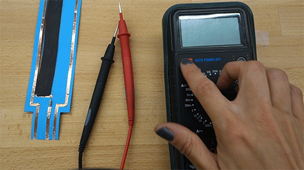
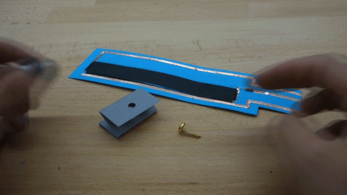

# **Slider sensor**
## **What does the sensor do?**
The ink is carbon based and conducts electricity when dry. The resistance varies depending on the length and thickness of the ink. It is widely used in the paper circuitry as it is low-cost and flexible. You can draw any shape with it or cut the shape out of paper painted with the ink. We are using it to make a "slider".

## **How do you embed the sensor onto paper?**
You will need:
- Paper template
- Scissors
- 6 strips of copper tape
- Copper pad
- Conductive ink and pre-painted paper
- Glue
- Resistor (resistance depends: resistor value = (resistance of conductive ink strip)/2)
- Multimeter
- Split pin
- Soldering equipment
- Paintbrush

*Before soldering arrange your components to make sure that it all fits together. You can use a small bit of masking tape to hold the components down while you solder.*

**Suggested sequence for making**
- Put one strip of copper tape to the side, and cut the rest of the copper tape in half lengthwise with a pair of scissors

- Cut a strip out of the conductive ink paper, and glue it to the template. Stick the small bits of copper tape down and use the conductive paint to bridge the conductive ink paper with the small strips of copper tape. Then leave to dry.

- Fold the full width tape under so half is on the back and front.

- Stick the rest of the copper tape to the paper.

- Use the multimeter to test the resistance of the full length of the conductive ink strip. The required resistor value will be half the total resistance. For example, the resistance in the example video above is approximately 676K ohms. To get the required resistor value divide 676K by 2 to get 338K, then use the closest value to 338K. The closest to this would be 380K.

- Solder the resistor. Need help with soldering? Feel free to ask someone if you are at a workshop, or adafruit [have a good soldering guide](https://learn.adafruit.com/adafruit-guide-excellent-soldering/making-a-good-solder-joint). Always wear protective glasses.

- Stick copper pad to a folded strip of paper, punch a hole in it, and attach to paper using a split pin.  

> **Handy hint!**  
> Make folds in the copper tape to keep a continuous connection.

>**Some technical info**
>We are using a "pull-down" resistor so that we can know the state of the sensor signal. Find out more about this [here](http://cnmat.berkeley.edu/recipe/how_and_why_add_pull_and_pull_down_resistors_microcontroller_i_o_).

## **What kind of interactions or movement can you sense?**
Slipping, Spinning the objects...and more  

> **Handy hint!**  
> For the consistency of the input signal, avoid folding or squeezing the conductive ink paper.
